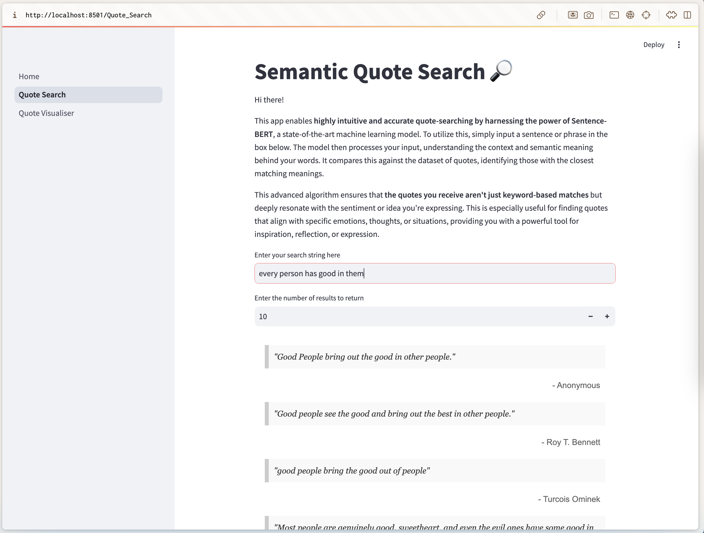

# Quote Finder 🔎📕

This app provides features for exploring and analyzing a dataset of English quotes. With intuitive tools and visualizations, you can search for quotes with specific meanings or understand the thematic distribution of quotes.

## Features
### 1. Quote Search
Search for quotes that resonate with a particular meaning by entering a text string. This feature helps you quickly find relevant quotes from the extensive dataset.

### 2. Quote Visualiser
Explore the thematic distribution of quotes using visualizations. This page provides insights into the dataset by categorizing quotes by topics.

> **This is still a TODO!**

## About the Dataset
The dataset contains nearly 500,000 quotes sourced from popular platforms such as:

- Goodreads
- BrainyQuote
- Famous Quotes & Authors
- Curated Quotes

It was made publicly available in 2018 by Shivali Goel, Rishi Madhok, and Shweta Garg. For more information about the dataset, visit the [GitHub repository](https://github.com/ShivaliGoel/Quotes-500K).

### How to Use
1. Navigate to the Quote Search page to find quotes based on specific keywords or phrases.
2. Visit the Quote Visualiser page to view topic-based visualizations of the quotes.

Enjoy!
